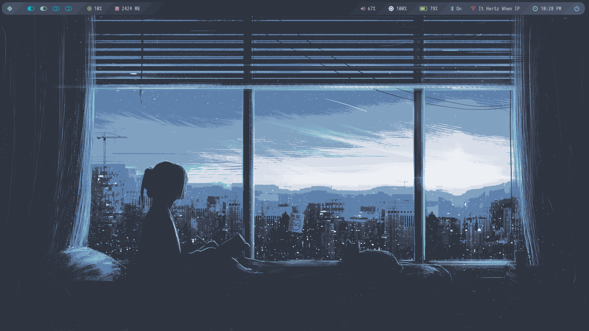
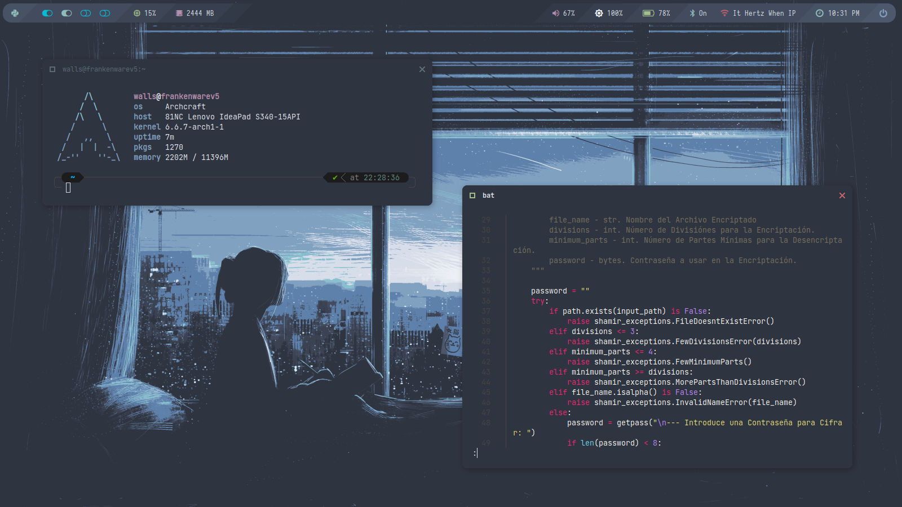
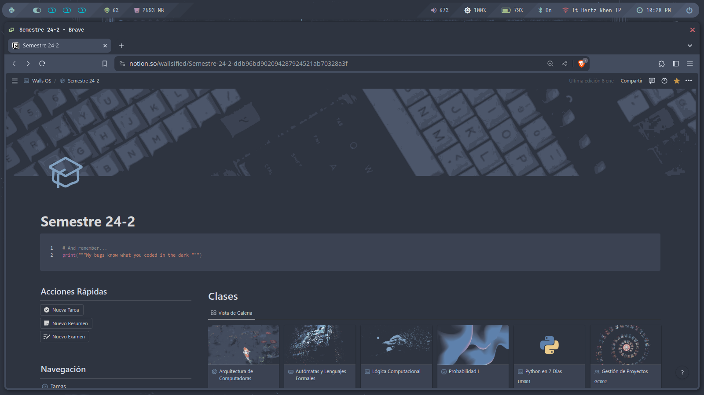
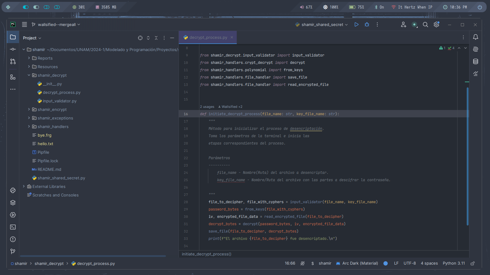
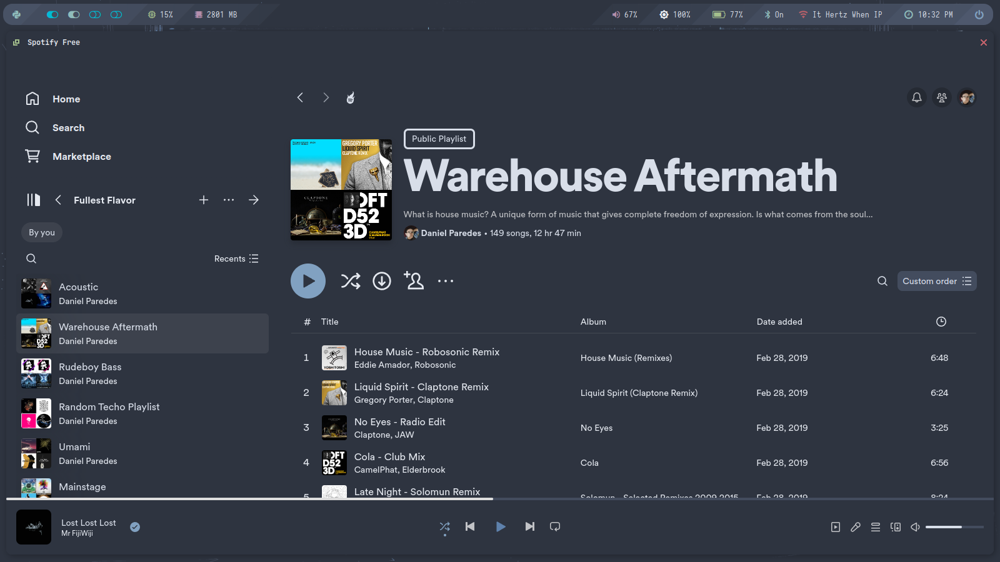
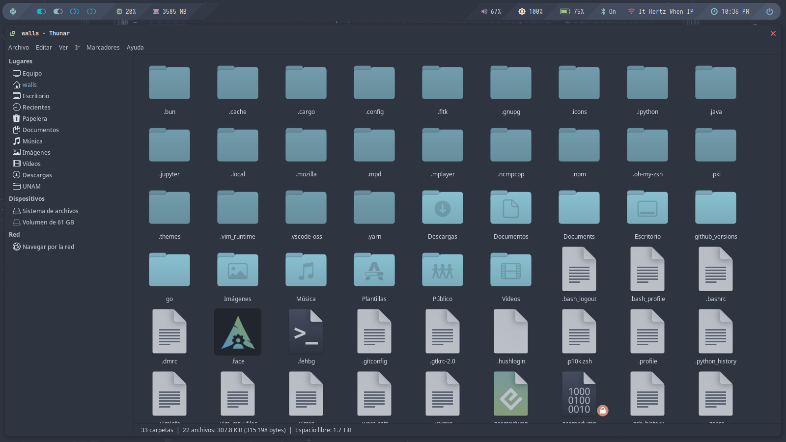
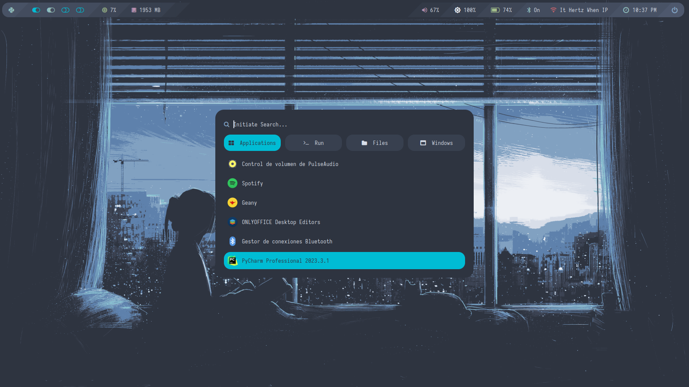
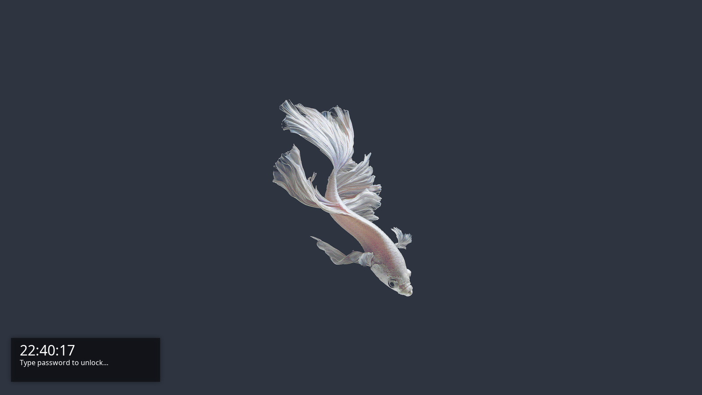

<h2 align='center'>
 Go with the (nord)flow...
</h2>

<br>

My Nord Remix on the Adaptive Theme for [Archcraft](https://archcraft.io/). 

## The System Setup
- **OS** - Archcraft
- **WM** - Openbox
- **Bar** - Polybar
- **Term** - Alacritty
- **Comp** - Picom
- **Menu/Launcher/Window Switcher** - Rofi
- **Shell** - Zsh w/ Powerlevel10k + Colorls
- **Music Player** - Spicetify w/Sleek Nord Theme
- **Wallpapers** Originally found in the [Nordic Wallpapers Repo](https://github.com/linuxdotexe/nordic-wallpapers)
- **Editor** Pycharm with Material Nord Theme

## The Browser Setup

- **Browser** - Brave Beta w/ [Nord Theme](https://chromewebstore.google.com/detail/nord-theme/dhlnjfhjjbminbjbegeiijdakdkamjoi)
- **Extensions** - [Notion Enhancer](https://github.com/notion-enhancer/notion-enhancer) + [Notion Themes](https://github.com/notionblog/NotionThemes)

Also, you can find the Notion Template in [here](https://www.notion.so/es-la/templates/nordic-dashboard).

## A look into the nordflow











## Dependencies

```sh
sudo pacman -Syu alacritty playerctl openbox nerd-fonts-jetbrains-mono ttf-jetbrains-mono brightnessctl networkmanager alsa-utils alsa-plugins alsa-firmware zsh betterlockscreen thunar vlc pfetch polybar
```

```sh
yay spicetify bat gotop colorls
```


> [!CAUTION]
> List is a wip. Still adding to this 


## Some keybinds

| Keybinds    | Launches |
| ----------- | -------- |
| `Super` + x     | Terminal |
| `Super` + z     | Brave |
| `Super` + r     | Rofi Launcher  |
| `Super` + q     | Close Window   |
| `Super` + s     | Screenshot Menu|
| `Super`+ n | Minimize |
| `Super` + d | Toggle Desktop |
| `Super` + e | Open File Manager   |
